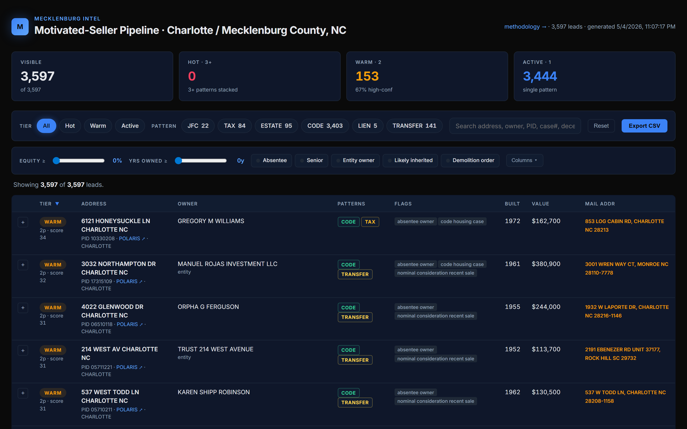

# Mecklenburg Intel

A flat-file motivated-seller intelligence pipeline for **Mecklenburg County, NC** (Charlotte). Joins public-records signals (parcel master, code enforcement, tax foreclosures, newspaper foreclosure / probate notices) on parcel ID and surfaces properties where multiple distinct distress patterns stack on the same address. Output is a single static dashboard.



> **Status:** test-run POC. Built across a few sessions on public data. The product is the static `index.html` + `data/leads.json`. Not a sold service.

---

## How it works

1. **Five scrapers** in `scrapers/` fetch raw public data (POLARIS parcel master, Charlotte HNS code enforcement, Kania + RBCWB tax foreclosure listings, mecktimes.com newspaper notices for foreclosures and probate). Each writes JSONL to `data/raw/`. A sixth scraper, `rod.py`, is a CSV importer for Register of Deeds data — the live ROD scrape is blocked by an Aumentum login wall.
2. **`pipeline/build_leads.py`** loads everything, joins on PID (or address / owner-name fuzzy matching for sources without a PID), runs each parcel through the six-pattern stack, computes derived fields (equity %, years owned, absentee, senior, likely-inherited, etc.), assigns a tier from the stack depth, and writes a single `data/leads.json`.
3. **`index.html`** is a single-file vanilla-JS dashboard that loads `data/leads.json`, applies live filters, expands per-row signal detail, and exports filtered sets to CSV ready for skip-trace upload.

The two non-negotiable design rules: tier comes from how many distinct patterns stack on a parcel (never from raw score sum), and filter counts are derived from the same `matches(lead)` function that builds the visible table. See [methodology.html](methodology.html) for the full spec.

---

## Data sources

| Source | What we use | Auth | Auto-scrape? |
|---|---|---|---|
| [POLARIS](https://meckgis.mecklenburgcountync.gov) | Master parcel table — PID, owner, mail addr, site addr, building specs, value, sale, deed bk/pg, exemption flags. ~446K parcels. | None | ✅ ArcGIS REST |
| [Charlotte HNS Code Enforcement](https://gis.charlottenc.gov) | Open code cases + Orders to Demolish. PID joins to POLARIS. | None | ✅ ArcGIS REST |
| [Kania Law Firm](https://kanialawfirm.com/tax-foreclosures-mecklenburg-county/foreclosure-listings/) | Active Mecklenburg tax-foreclosure cases (~862). | None | ✅ WordPress AJAX |
| [RBCWB](https://www.rbcwb.com/tax-foreclosure-listings/) | Active Mecklenburg tax-foreclosure cases (~22). | None | ✅ HTML table |
| [mecktimes.com](https://mecktimes.com/public-notice/) | Foreclosure / probate newspaper notices (NC-statute-required). | None | ⚠️ Cloudflare — seed only |
| [Mecklenburg Register of Deeds](https://meckrod.manatron.com) | Liens, judgments, quitclaim deeds, DOTs. | Login required | ❌ CSV import only |
| [eCourts (Tyler Odyssey)](https://portal-nc.tylertech.cloud/) | SP / E case detail. | Anonymous, but CAPTCHA-gated | ❌ Not scraped |

Anti-bot details and workarounds are documented in `scrapers/README.md`.

---

## What's not included (and why)

- **Register of Deeds data** — `meckrod.manatron.com` is fully login-walled, no public guest credentials, ASP.NET viewstate. Phase 3 reconnaissance details in `scrapers/README.md`. The pipeline ships a CSV-importer (`scrapers/rod.py`) so a logged-in human export can hydrate the `lien` and `transfer` patterns. Without it, the `lien` pattern fires only from mecktimes HOA notices and CV-execution sales, and `transfer` fires from POLARIS sale heuristics only. **This is the single biggest gap.** Once ROD is loaded, Hot-tier (3+ patterns stacked) leads become abundant.
- **eCourts case detail** — CAPTCHA-gated. The mecktimes newspaper-notice flow covers the events (foreclosure sales, estate openings) that go to public notice by statute, with a 1-7 day publication lag.
- **Code enforcement outside Charlotte** — `code.mecknc.gov` (Cornelius / Davidson / Huntersville / Matthews / Mint Hill / unincorporated) has no open-data feed.
- **Annual delinquent-tax PDF** — published once a year. The active-foreclosure flow (Kania + RBCWB) covers the higher-signal subset.
- **Skip-trace contact info, MLS valuations, mortgage balances** — all out of scope. The CSV export includes empty `phone1`..`phone3` / `email1`..`email2` columns so a downstream skip-trace vendor can fill them.

---

## Local dev

Requires Python 3.12 at `C:\Users\Owner\AppData\Local\Programs\Python\Python312\python.exe`. (Adjust path for your machine.)

```bash
# Pull raw data (POLARIS full pull is ~5 min, code violations ~5 min)
python scrapers/polaris.py
python scrapers/code_violations.py
python scrapers/tax_delinquent.py

# foreclosures + estates from this build are seeded — the live mecktimes
# scraper is Cloudflare-blocked from most networks. See scrapers/README.md.

# Build the lead set
python pipeline/build_leads.py
# -> data/leads.json

# Serve the dashboard
python -m http.server 8765 --bind 127.0.0.1
# open http://127.0.0.1:8765/
```

---

## Layout

```
mecklenburg-intel/
├── pipeline/build_leads.py    # joins + scoring + leads.json output
├── scrapers/                  # one scraper per source — fetch only
├── data/
│   ├── raw/                   # gitignored — raw scraped JSONL
│   └── leads.json             # the deliverable; committed
├── docs/                      # screenshots
├── index.html                 # single-file dashboard
├── methodology.html           # data sources, scoring, limitations
├── RECON.md                   # source inventory + adapted 6-pattern stack
└── README.md                  # this file
```

---

## What you'll see in the dashboard

- **Tier breakdown** — Hot / Warm / Active counts derived from the same filtered set as the visible table.
- **Pattern pills** — JFC / TAX / ESTATE / CODE / LIEN / TRANSFER, multi-select.
- **Filters** — equity %, years owned, absentee toggle, senior toggle, entity-only toggle, demolition order toggle, free-text search across address / owner / PID / case # / decedent name / signal payload.
- **Per-row expand** — full structured detail (identity, owner, mailing, structure, land, value, sale, exemptions) plus all signal payloads with source links.
- **CSV export** — filtered set, ready for skip-trace upload (PID, owner parsed into first/middle/last, mailing addr structured, phone/email placeholders).
- **POLARIS link per row** — opens the official parcel viewer at `polaris3g.mecklenburgcountync.gov?taxid=<PID>`.

See [methodology.html](methodology.html) for the rules behind every pattern, the known noise sources, and what's deliberately excluded.

---

⚡ — Built by Jarvis (Just Jarvis LLC) for Quentin Flores. Operator-first.
